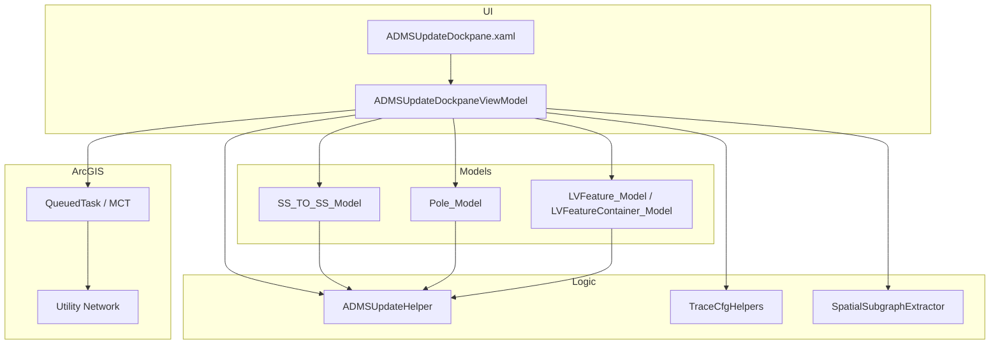

# CLP.ADMSUpdatePlugin — Project Documentation

ArcGIS Pro add-in that reads Utility Network topology (associations + connected traces), computes ADMS Name / Alias / SOM fields, previews them in a dockpane, and writes results back to geodatabase features.

---

## Table of contents

1. [Overview](#overview)
2. [Technology stack](#technology-stack)
3. [Architecture](#architecture)
4. [Repository layout](#repository-layout)
5. [User interface flow](#user-interface-flow)
6. [Update modes](#update-modes)
7. [Data models](#data-models)
8. [ADMS naming (`ADMSUpdateHelper`)](#adms-naming-admsupdatehelper)
9. [Infrastructure classes](#infrastructure-classes)
10. [Development rules](#development-rules)
11. [Related documents](#related-documents)

---

## Overview

The add-in exposes a single dockpane (**Update ADMS**) with five update workflows. Each workflow:

1. Lets the user pick an **Update Mode** and select features on the map.
2. Runs **association lookups** and/or **Utility Network traces** on the MCT (`QueuedTask.Run`).
3. Builds a view-model object with computed ADMS fields.
4. Shows a **Preview** (where applicable) and writes `ADMS_Name`, `ADMS_Alias`, and optionally `SOM_SS` / `SOM_CCT` (and cable-specific fields) via `EditOperation`.

All logic assumes an active map containing a **Utility Network layer** with an Electric domain (HV and LV tiers).

---

## Technology stack

| Item | Value |
|------|-------|
| Language | C# 12 |
| Framework | .NET 8 (`net8.0-windows`) |
| UI | WPF + MVVM |
| Host | ArcGIS Pro 3.3 SDK |
| Logging | NLog (`LoggerHelper`) |
| JSON | Newtonsoft.Json (trace / snapshot support) |

Entry point: ribbon button **Update ADMS** → dockpane registered in `Config.daml`.

---

## Architecture



**Pattern**

- ViewModels inherit `PropertyChangedBase`.
- Commands: `NextStepCommand`, `BackCommand`, `UpdateCommand`, `RefreshCommand` (`RelayCommand`).
- Map selection handled in `OnMapSelectionChanged` — filters by `UpdateMode`.
- Heavy UN work always inside `QueuedTask.Run`.

---

## Repository layout

| File | Role |
|------|------|
| `Config.daml` | Add-in registration, ribbon button, dockpane |
| `Module1.cs` | Add-in module bootstrap |
| `ADMSUpdateDockpane.xaml` | All UI panels (search + 6 update panels) |
| `ADMSUpdateDockpane.xaml.cs` | View code-behind |
| `ADMSUpdateDockpaneViewModel.cs` | Core orchestration: selection, trace, Next/Back/Update/Preview |
| `ADMSUpdateHelper.cs` | ADMS Name / Alias / SOM string formulas |
| `SS_TO_SS_Model.cs` | HV substation-to-substation CB / Transformer model |
| `Pole_Model.cs` | Manual pole device model + UI visibility/enable flags |
| `LVFeature_Model.cs` | LV feature model + `LVFeatureContainer_Model` |
| `SpatialSubgraphExtractor.cs` | Trace result → `FeatureSnapshot` dictionary |
| `TraceCfgHelpers.cs` | Network attribute lookup, composable barrier builders |
| `UtilityNetworkTraceRunner.cs` | Connected trace runner + `TraceBarrierPreset` barrier sets |
| `FeatureQueryHelper.cs` | Map layer lookup and GLOBALID feature queries |
| `LoggerHelper.cs` | NLog wrapper |
| `BooleanToVisibilityConverter.cs` | WPF visibility converter |
| `.cursor/rules/standard_rule.mdc` | Coding standards for AI / contributors |
| `.cursor/plans/` | Feature-specific implementation plans |

---

## User interface flow

### Panels (controlled by ViewModel booleans)

| Panel property | When shown |
|----------------|------------|
| `ShowSearchPanel` | Initial step: pick mode + map selection list |
| `ShowUpdatePanel` | SS_TO_SS result |
| `ShowSpareCBUpdatePanel` | Spare CB result |
| `ShowPolePanel` | Pole manual update |
| `ShowPoleCablePanel` | Bulk cable/OHL update |
| `ShowLVFeaturePanel` | LV feature parent panel |
| `ShowLVSourceFusePanel` | LV Source Fuse sub-panel |
| `ShowLVSupplyPointPanel` | Single Supply Point |
| `ShowLVPillarFusePanel` | Pillar Fuse + related |
| `ShowLVLinkBoxPanel` | Link Box / LV Switch |
| `ShowLVMotherSupplyPointPanel` | Mother Supply Point (pole fuse branch) |

### Common steps

```
Select Update Mode → Map select feature(s) → Next Step
    → [Association / Trace on MCT]
    → Show update panel → [Preview optional] → Update
```

**Back** resets all panel flags and returns to search panel.

---

## Update modes

### 1. `SS_TO_SS` — Update SS To SS

**Selection:** `HV Line` polyline — `Connector` or `Cable`.

**Trace (HV tier, from selected line):**

- Terminal: `CB:Line Side` (or `Load` for Source Circuit Breaker).
- Barriers (OR): `E:Switch`, `AssetGroup = 51`, non-in-service `LifeCycleStatus` (0, 3, 4).

**Logic:**

- Extract ≤ 2 endpoints: HV Switches and/or Transformers.
- Resolve substation association for each switch (`Substation` → `HV Switch`).
- Detect result type: `CB_TO_CB` or `CB_TO_TRANSFORMER`.
- Resolve busbar / bus nodes for bus ADMS fields.
- Compute cable ADMS from first/second switch models + cable features in trace.

**Update writes:**

- First / Second HV Switch (if checkbox checked): `ADMS_Name`, `ADMS_Alias`, `SOM_SS`, `SOM_CCT`
- Busbar + BusNodes: `ADMS_Name`, `ADMS_Alias`
- Cables (optional checkbox): `ADMS_Name`, `ADMS_Alias`, `terminated_substation`

**Model:** `SS_TO_SS_Model` (×2) + cable list.

---

### 2. `SpareCB` — Update Spare CB

**Selection:** `HV Switch` — `Circuit Breaker` or `Source Circuit Breaker`.

**Logic:**

- Direct association lookup (no trace).
- Find `Substation` → `HV Switch` container association.
- Build single `SS_TO_SS_Model` with `Target = null` (spare CB naming path).

**Update writes:** `ADMS_Name`, `ADMS_Alias`, `SOM_SS`, `SOM_CCT` (if checked).

---

### 3. `Pole` — Manual Update Pole Feature

**Selection:** one of:

| Asset Group | Asset Type |
|-------------|------------|
| HV Switch | Isolator, Switch, Subring Circuit Breaker |
| Transformer | HV PM TX |
| HV Fuse | Fuse |

**Two association paths:**

| Path | Condition | Container |
|------|-----------|-----------|
| Pole path | `Support Structure` → device | Pole (`Support Structure` / HV Pole) |
| Substation path | `Substation` → device | Substation (Subring CB only) |

#### Asset-specific behavior

| Asset Type | Association | Trace terminal | Notable UI |
|------------|-------------|----------------|------------|
| Switch (PMS) | Pole | — | Minimal fields; SOM + ADMS |
| HV PM TX | Pole | — | Minimal fields; SOM + ADMS |
| Fuse | Pole | Node 2 | Co-pole Switch/Transformer → `IsTxOrPMSInPole` + `InPoleType`; first traced Transformer → `FROM_SS_*`; To Pole dropdown from trace (hidden when co-pole Transformer; shown when no co-pole device or co-pole PMS) |
| Isolator | Pole | SS:S1 | `isolatorTraceHasSubringCB` true → To SS (auto-fill if Substation); false → To Pole dropdown (excludes From pole); no barrier in trace → same as false |
| Subring CB | Substation | CB:Line Side | Hide From Pole + To SS; always To Pole dropdown |

#### Isolator trace barrier device resolution

After `HvIsolatorLike` trace, collect all traced HV Pole `POLENUM` values into the To Pole dropdown (excluding the Isolator’s From pole via `ToPoleNoOptions`).

Trace is checked for **Subring Circuit Breaker** or **Switch** (`isolatorTraceHasSubringCB`). If found, the first Subring CB (else first Switch) is resolved by containment:

| Outcome | `isolatorTraceHasSubringCB` | UI |
|---------|----------------------------|-----|
| `Substation` → device | stays **true** | Hide To Pole; show To Substation; auto-fill `TO_SS_NAME` / `TO_SS_NUM` from substation |
| `Support Structure` (pole) → **Switch** only | set **false** | Hide To Substation; show To Pole dropdown (all trace poles minus From pole) |
| Subring CB not in substation (other cases) | stays **true** | Hide To Pole; show To Substation (manual entry) |
| No Subring CB/Switch in trace | **false** | Hide To Substation; show To Pole dropdown |

When `isolatorTraceHasSubringCB` is **false**, `TO_SS_NAME` / `TO_SS_NUM` are not populated from the traced Switch.

**Trace barriers (HV tier, via `TraceBarrierPreset`):**

| Asset type | Preset | Barriers (OR chain) |
|------------|--------|---------------------|
| Isolator, Subring CB | `HvIsolatorLike` | `E:Switch`; `AssetGroup` 61, 51; `LifeCycleStatus` 0, 1, 3, 4 |
| Fuse | `HvFuse` | Strip tier defaults for Life Cycle Status / Asset Type; then `AssetGroup` 61, 51; `LifeCycleStatus` 0, 1, 3, 4 (no `E:Switch` category barrier) |

See [UtilityNetworkTraceRunner](#utilitynetworktracerunner) for all presets.

**After trace:** `HighlightPathOnMapAsync` selects trace features on the map.

**Update writes:**

| Asset Type | ADMS | SOM |
|------------|------|-----|
| Isolator | ✓ | ✓ |
| Switch | ✓ | ✓ |
| Subring CB | ✓ | ✓ |
| Fuse | ✓ | — |
| HV PM TX | ✓ | — (preview only via model) |

**Model:** `Pole_Model` with `Show*` / `Enable*` flags — see [Pole plan](../.cursor/plans/pole-function-enhancement.plan.md).

---

### 4. `PoleCable` — Multiple Update Pole Cable/OHL

**Selection:** `HV Line` — `Cable` or `Overhead Line` (multi-select).

**Logic:** No trace. User enters shared `CIRCUIT_NAME` / `CIRCUIT_ID`; each selected line gets ADMS from object ID.

**Formulas:**

- Name: `GetADMSNameForPoleCable(circuitName, objectId)`
- Alias: `GetADMSAliasForPoleCable(circuitId, objectId)`

**Update:** loops all `SelectionElements`.

---

### 5. `LVFeature` — Update LV Feature (Validating)

**Selection:**

| Asset Group | Asset Type | Branch |
|-------------|------------|--------|
| LV Fuse | Source Fuse | Source Fuse panel |
| LV Service Point | Supply Point | Supply Point panel |
| LV Fuse | Fuse | Pillar Fuse or Mother Supply Point |
| LV Switch | Switch | Link Box panel |

#### Source Fuse

- Trace from **Source** terminal (LV tier).
- Barriers: Subnetwork Controller, non-in-service lifecycle, AssetGroup 51.
- Finds upstream Transformer; collects all Source Fuses + Local Supply Points.
- `LVFeatureContainer_Model` with update-all / selected-only checkboxes.

#### Supply Point

- Single feature; reads SUBNETWORKNAME, SPSID, ADDRESS.

#### Pillar Fuse

- Association to Pillar Circuit Box.
- Trace with `E:Switch - Fuse` barrier.
- Container holds multiple Pillar Fuses + optional Pillar Circuit Box.

#### Link Box (LV Switch)

- Association to Link Box.
- Trace with `E:Switch` barrier from switch terminal.
- Collects LV Switches, Supply Point, Link Box.

#### Mother Supply Point

- Triggered when Pillar Fuse has Pole association.
- Two-step trace: (1) find closed Source Fuse, (2) trace from Source Fuse to Transformer.
- Uses pole `POLENUM`, transformer SS/TX, Source Fuse `CCT_NO`.

**Update:** respects checkbox state via container computed lists:

- `SourceFusesToUpdate`, `PillarFusesToUpdate`, `LVSwitchesToUpdate`
- Optional: Local Supply, Pillar Circuit Box, Link Box, Supply Point

---

## Data models

### `SS_TO_SS_Model`

HV switch at a substation. Properties: `SSCODE`, `SSNAME`, `SERIALNUMBER`, `BB_NUMBER`, `PANEL_NO`, `TX_NO`.

Computed: `ADMSName`, `ADMSAlias`, `BusADMSName`, `BusADMSAlias` (delegates to `ADMSUpdateHelper` based on source/target asset types).

References: `Source`, `Target`, `Substation`, `Busbar`, `BusNodes`, `Transformer`.

### `Pole_Model`

Pole-mounted or substation-contained device.

**Field properties:** `CIRCUIT_NAME`, `CIRCUIT_ID`, `FROM_POLE_NUM`, `TO_POLE_NUM`, `FROM_SS_NAME`, `FROM_SS_NUM`, `TO_SS_NAME`, `TO_SS_NUM`, `InPoleType` (`null`, `"Transformer"`, or `"PMS"`).

**UI flags:**

| Visibility | Enable |
|------------|--------|
| `ShowCircuitFields` | `EnableCircuit` |
| `ShowFromSubstationFields` | `EnableFromSubstation` |
| `ShowToSubstationFields` | `EnableToSubstation` |
| `ShowFromPoleNo`, `ShowToPoleNo` | |
| `ShowToPoleNoDropdown`, `ToPoleNoOptions` | |
| `ShowSOMFields`, `ShowCheckBoxs` | |

**Behavior flags:** `IsTxOrPMSInPole`, `IsSingleDevice` — `IsTxOrPMSInPole` setter updates related Show flags per asset type.

**Co-pole detection (`InPoleType`):** Default `null`. Set during Pole `NextStepAsync` when a co-located device is found on the pole:
- Co-pole association lookup (`txAttributes`) — Isolator and other non-Fuse types → `IsTxOrPMSInPole = true`; `InPoleType = "PMS"` if asset type is Switch, `"Transformer"` if asset group is Transformer.
- HV Fuse — pole association lookup (before trace) → same `IsTxOrPMSInPole` / `InPoleType` rules; trace still requires a Transformer and uses the **first traced Transformer** for `FROM_SS_NAME` / `FROM_SS_NUM` only. `ToPoleNoOptions` is always populated from the trace; dropdown visible when no co-pole device or co-pole PMS (`InPoleType == "PMS"`).

**Computed:** `ADMS_Name`, `ADMS_Alias`, `SOMSS`, `SOMCCT` → `ADMSUpdateHelper` by `ASSET_TYPE`.

`ResetFieldFlags()` restores all Show/Enable defaults.

### `LVFeature_Model`

Single LV feature with attributes: `SUBNETWORKNAME`, `CCT_NO`, `SS_NAME`, `SS_NUM`, `TX_NO`, `PR_NO`, `PR_NAME`, `SPSID`, `ADDRESS`, `POLENUM`, `LEG`.

Flags: `IsPoleSourceFuse`, `IsMotherSupplyPoint`.

Computed: `ADMS_Name`, `ADMS_Alias`, `SOMSS`, `SOMCCT`.

### `LVFeatureContainer_Model`

Aggregates related LV features for multi-record update UI. Exposes checkbox properties and computed update lists based on all/selected toggles.

### `FeatureSnapshot`

Produced by `SpatialSubgraphExtractor`. Wraps UN element + attribute dictionary + helpers (`GetString`, etc.). Used everywhere instead of raw `Row` after extraction.

---

## ADMS naming (`ADMSUpdateHelper`)

Central formula library. Grouped by domain:

### HV SS-to-SS

| Method | Purpose |
|--------|---------|
| `GetADMSNameForCBToCB` | CB → CB name |
| `GetADMSAliasForCBToCB` | CB → CB alias |
| `GetADMSNameForCBToTransformer` | CB → Transformer name |
| `GetADMSNameForTransformer` | Transformer name |
| `GetADMSAliasForTransformer` | Transformer alias |
| `GetADMSNameForSpareCB` | Spare CB name |
| `GetCableADMSName` / `GetCableADMSAlias` | Cable between two SS models |
| `GetBusADMSName` / `GetBusADMSAlias` | Busbar naming |
| `GetCB_SOM_SS` / `GetCB_SOM_CCT` | CB SOM fields |
| `GetSpare_CB_SOM_CCT` | Spare CB SOM CCT |
| `GetCable_Terminal_Substation` | Cable terminated substation |

### HV Pole

| Method | Asset |
|--------|-------|
| `GetADMSNameForIsolator` / `GetADMSAliasForIsolator` | Isolator |
| `GetIsolator_SOM_SS` / `GetIsolator_SOM_CCT` | Isolator SOM |
| `GetADMSNameForFuse` / `GetADMSAliasForFuse` | Fuse |
| `GetSOMSSForFuse` / (SOMCCT) | Fuse SOM (preview; not written on update) |
| `GetADMSNameForPMS` / `GetADMSAliasForPMS` | Switch |
| `GetPMS_SOM_SS` / `GetPMS_SOM_CCT` | Switch SOM |
| `GetADMSNameForTransformer` / `GetADMSAliasForTransformer` | HV PM TX (pole) |
| `GetADMSNameForSubringCB` / `GetADMSAliasForSubringCB` | Subring CB |
| `GetSubringCB_SOM_SS` / `GetSubringCB_SOM_CCT` | Subring CB SOM |
| `GetADMSNameForPoleCable` / `GetADMSAliasForPoleCable` | Cable/OHL bulk |

### LV

| Method | Asset |
|--------|-------|
| `GetADMSNameForSourceFuse` / `GetADMSAliasForSourceFuse` | Source Fuse |
| `GetSOMSSForSourceFuse` / `GetSOMCCTForSourceFuse` | Source Fuse SOM |
| `GetADMSNameForPoleSourceFuse` / … | Pole Source Fuse variant |
| `GetADMSNameForLocalSupply` / … | Local Supply |
| `GetADMSNameForSupplyPoint` / … | Supply Point |
| `GetADMSNameForPillarFuse` / … | Pillar Fuse |
| `GetADMSNameForPillar` / … | Pillar Circuit Box |
| `GetADMSNameForMotherSupplyPoint` / … | Mother Supply Point |
| `GetADMSNameForLinkBox` / `GetADMSNameForLinkBoxLeg` / … | Link Box + LV Switch leg |

Utility: `ReplaceMultipleSpaces` — normalizes whitespace in padded ADMS strings.

---

## Infrastructure classes

### `SpatialSubgraphExtractor`

- Input: UN trace results or explicit `Element` list.
- Output: `FeatureByGlobalId` dictionary of `FeatureSnapshot`.
- Must run on MCT.
- Caches configured attribute fields per network source.

### `TraceCfgHelpers`

- `FindNetworkAttribute(definition, params names[])` — resolves attribute by alias.
- `RemoveAttrFromBarriers(barriers, attrNames[])` — strips default tier barriers before custom OR chain.
- `CreateTierConfiguration(def, tierName)` — HV/LV tier base config (propagators cleared, junctions + edges scope).
- `AddCategoryBarrier`, `AddAssetGroupBarriers`, `AddLifeCycleBarriers`, `AddNetworkAttributeBarrier`, `AddOrBarrier` — composable barrier builders used by the trace runner.

### `UtilityNetworkTraceRunner`

MCT-only connected trace wrapper. ViewModel passes a `TraceRunRequest` (tier, terminal, preset); runner applies terminal, builds configuration, runs `ConnectedTracer`, and returns `FeatureSnapshot` list via `SpatialSubgraphExtractor`.

| Preset | Used by | Barriers (OR unless noted) |
|--------|---------|------------------------------|
| `HvIsolatorLike` | Pole Isolator, Subring CB | `E:Switch`; AG 61, 51; lifecycle 0, 1, 3, 4 |
| `HvFuse` | Pole Fuse | Remove tier Life Cycle / Asset Type defaults; AG 61, 51; lifecycle 0, 1, 3, 4 |
| `HvSsToSs` | SS_TO_SS Next Step | `E:Switch`; strip NormalOperatingStatus + Life Cycle defaults; lifecycle 0, 3, 4; AG 51 |
| `HvBusbar` | SS_TO_SS busbar trace | `E:Switch`; strip NormalOperatingStatus + Life Cycle defaults; lifecycle 1 only |
| `LvSourceFuse` | LV Source Fuse, Mother Supply step 2 | Subnetwork Controller; strip NormalOperatingStatus + Life Cycle defaults; lifecycle 0, 3, 4; AG 51 |
| `LvPillarFuse` | Pillar Fuse | `E:Switch - Fuse` category only |
| `LvMotherSupplyFirst` | Mother Supply step 1 | Subnetwork Controller; NormalOperatingStatus Open; lifecycle 0, 1, 3, 4 |
| `LvLinkBox` | Link Box Switch | `E:Switch` category only |

### `FeatureQueryHelper`

- `GetFeatureLayer(layerName)` — flattened map layer lookup.
- `QueryFeatureSnapshotByGlobalId(un, layerName, globalId)` — GLOBALID query → `FeatureSnapshot`.
- `QueryRowByGlobalId(layerName, globalId)` — raw `Row` for attribute reads (e.g. pole transformer lookup).

### `LoggerHelper`

NLog-based `Info` / `Error` logging around trace timing, association steps, and update operations.

### `HighlightPathOnMapAsync`

Clears map selection and selects trace result features (used after most traces).

---

## Development rules

From `.cursor/rules/standard_rule.mdc`:

1. **MCT thread** — All map, layer, geodatabase, and UN API calls inside `QueuedTask.Run`.
2. **MVVM** — ViewModels use `PropertyChangedBase`; bindings in XAML.
3. **Minimal diffs** — Change only what the task requires; match existing naming and patterns.
4. **ADMSUpdateHelper** — Do not modify unless explicitly requested; formulas are the single source of truth.
5. **Disposal** — Use `using` for UN objects, cursors, and inspectors.

---

## Related documents

| Document | Purpose |
|----------|---------|
| [`.cursor/plans/pole-function-enhancement.plan.md`](../.cursor/plans/pole-function-enhancement.plan.md) | Pole mode implementation status, per-asset workflows, debug hotspots |
| [`.cursor/rules/standard_rule.mdc`](../.cursor/rules/standard_rule.mdc) | C# / ArcGIS Pro coding standards |

---

*Last updated from codebase review — ArcGIS Pro add-in v2.01, .NET 8.*
